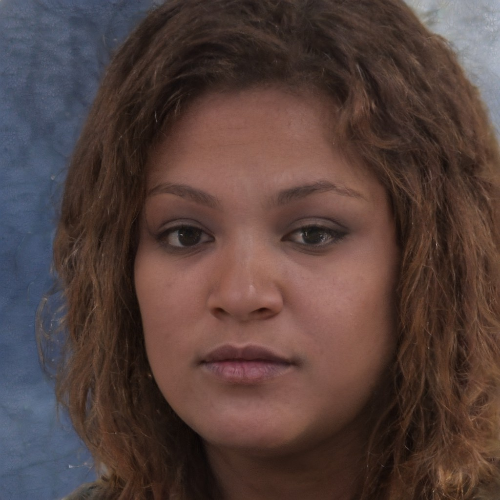
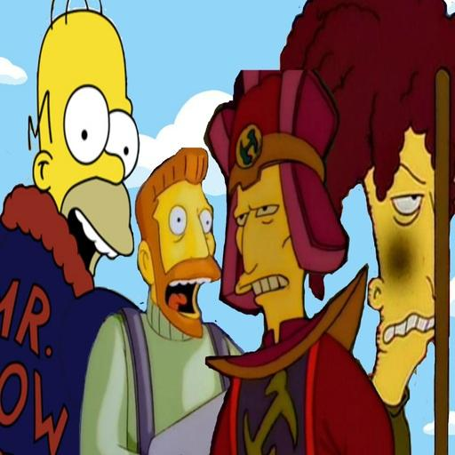
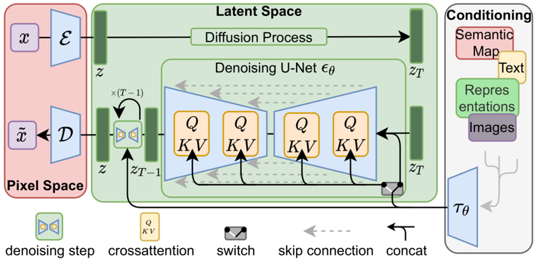

## DA35-4th-MMPP-MMPP
# 모델링 기법 선정 보고서
  
## 1. 프로젝트 주제 
    1) 주제 선정 동기 
      오픈카톡, 디스코드 등 공통된 화제를 가진 사람들이 익명으로 모여 채팅할 수 있는 서비스는 많은 인기를 누리는 중이다. 이러한 서비스들은 각 채팅방마다 임시 프로필 사진을 설정하도록 하는데, 매번 적절한 사진을 선택하는 것은 번거로운 일이다.

    2) 해결 방안 
      사용자의 개성을 반영하면서도 개인 정보를 숨기며, 채팅방 내에서 통일성을 유지할 수 있는 프로필 사진 생성 서비스가 제공된다면 사용자 만족도가 증가할 것이다.

    3) 프로젝트 소개 : MMPP(Make My Profile Photo)
      특정 아트 스타일을 기반으로 사용자의 얼굴 사진을 재구성한 프로필 사진을 생성하여 제공하는 것을 목표로 한다.

## 2. 데이터 설명
**Synthetic Face High Quality (SFHQ)** 

 - [출처](https://www.kaggle.com/datasets/selfishgene/synthetic-faces-high-quality-sfhq-part-1)            
- 데이터 타입 : image
- 이미지 크기 : 1024 * 1024 
- 데이터 특징 : 이미지 생성 모델에 사용하기 위해 합성으로 생성된 사람의 얼굴 이미지 데이터 셋이다.

**Norod78/simpsons-blip-captions** 

 - [출처](https://huggingface.co/datasets/Norod78/simpsons-blip-captions)
 - 데이터 타입 : image, text
 - 이미지 크기 : 512 * 512
 - 텍스트 내용 : 이미지에 대한 캡션
 - 테이터 특징 : 심슨 애니메이션의 이미지를 512*512 크기로 캡션과 함께 제공한다.

## 3. 모델링 기법 후보    
    1) GAN (Generative Adversarial Networks)
     적대적 생성 네트워크. 이미지 생성 모델과 검증 모델을 경쟁시켜 생성 이미지 품질을 향상시킨다.
    
    2) Diffusion Model
     확산 모델. 조건과 함께 노이즈를 복원하는 방식으로  이미지를 생성한다.

## 4. 모델 선정 기준 및 모델링 기법들 비교
    1) 모델 선정 기준
        - 유연성
        - 추론 속도
        - 학습 속도 및 리소스
        - 이미지 품질
  
    2) 각 모델의 선정 기준 적합성

        - GAN
          - 유연성 : 모델 구조의 유연성은 Diffusion 모델에 비해 상대적으로 높다. 하지만 모드 붕괴(model collapse)의 문제로 인해 모델당 생성할 수 있는 이미지의 유연성은 적다고 할 수 있다.
          - 추론 속도 : 한번의 전방향 전파로 빠른 속도로 이루어진다.
          - 학습 속도 및 리소스 : Diffusion에 비해 상대적으로 적은 시간과 리소스를 요구한다.
          - 이미지 품질 : 매우 높은 품질의 이미지를 생성할 수 있으나, 모드 붕괴나 아티팩트(visual artifact, 노이즈, 반복, 깨짐문제 등 디지털 이미지의 불완전성을 의미) 문제가 발생할 수 있다.
  
        - Diffusion
          - 유연성 : 모델 구조는 덜 유연하지만, 디테일 추론과 복원 능력의 강력함으로 인해 GAN에 비해 하나의 모델이 생성할 수 있는 이미지가 유연하다.
          - 추론 속도 : 반복적인 노이즈 제거 과정을 거치고 연산량 또한 많기에 추론속도가 느리다.
          - 학습 속도 및 리소스 : 많은 학습 시간과 리소스를 요구한다.
          - 이미지 품질 : 다양한 연구를 통해 GAN에 버금가는 이미지 품질을 생성하며 안정성이 높다. 
  
    3) 각 모델의 장단점 분석
        - GAN
          - 장점 : 다양하게 응용 및 변형 가능한 모델 구조, 빠른 학습 시간과 추론 속도, 높은 이미지 품질
          - 단점 : 생성되는 이미지의 안정성 문제, 하나의 모델이 다양한 이미지 생성을 요구할 시 문제가 발생할 수 있음

        - Diffusion
          - 장점 : 안정적이고 다양한 이미지 생성 능력, 높은 이미지 품질
          - 단점 : 많은 학습 시간과 리소스가 요구되며, 추론 시간 또한 길어 실시간 서비스 제공에 부적합함.

## 5. 선정된 기법
    a. 최종 선정 모델링 기법
        - Stable Diffusion XL을 Dreambooth 기법과 LoRA 기법을 이용해 파인튜닝한다.
    
    b. 선정 이유
        - 이미지 품질이 높고, LoRA로 다양성 및 적절한 학습 속도를 확보할 수 있으며, 추론 속도 또한 Scheduler의 개선을 통해 높일 수 있다. 프로필 사진 생성이라는 작업은 실시간으로 변화하는 이미지를 요구하지 않기에 느린 편인 추론속도 또한 커버 가능하다. SDXL base 1.0은 CreativeML Open RAIL++-M License로 비윤리적이거나 불법적인 용도가 아니라면 상업적으로도 사용 가능하다.
  
  

    c. 선정 모델에 대한 설명

    - 모델 구조
        - 레이어 수 : 1680
        - 파라미터 수 : 2567463684
        - 이외에도 ControlNet, IP Adapter, LoRA 등 사용 상황에 따라 파라미터 수가 변하지만, 기본 모델의 크기에 비하면 대부분 무시 가능한 수준이다.

    d. 사용된 기술

        - LoRA : Low Rank Adaptaion for LLM, Weight 변화량을 하나의 Metrics에 모은 뒤, 이를 Low Rank로 분해한 행렬에 근사하여 학습량을 대폭 낮추고 원본 모델의 추론 능력을 유지한다. 

        - Dreambooth : 특정 토큰에 이미지 특성을 오버피팅 시켜 원하는 이미지 특징을 해당 토큰을 이용해 불러올 수 있도록 한다.

        - ControlNet : 이미지의 모양적 특성을 Denoising Condition으로 제공하여 생성 되는 이미지의 모양적 특성을 제어 가능하다.
  
        - IP Adapter : Denoising Condition에 임의의 이미지를 압축한 데이터와 Cross Attention하여 해당 이미지에 특화된 이미지를 새로 생성할 수 있도록 하는 기술.
