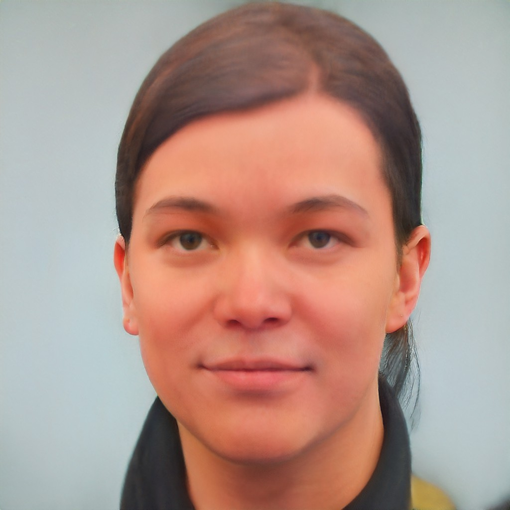

## DA35-4th-MMPP-MMPP
# 테스트 설계 보고서

## 1. 모델 평가 기준
    - 성능 지표 : 시간상의 문제로 직관적인 이미지 품질로만 판단하였다.
    - 처리 속도 : interference step 당 1초 전 후, 이미지 생성 당 약 40번의 step

## 2. 테스트 환경
    - 하드웨어 : Google Colab L4
    - 소프트웨어 : Diffuser Pipeline

## 3. 테스트 결과

예시 : 사람 

